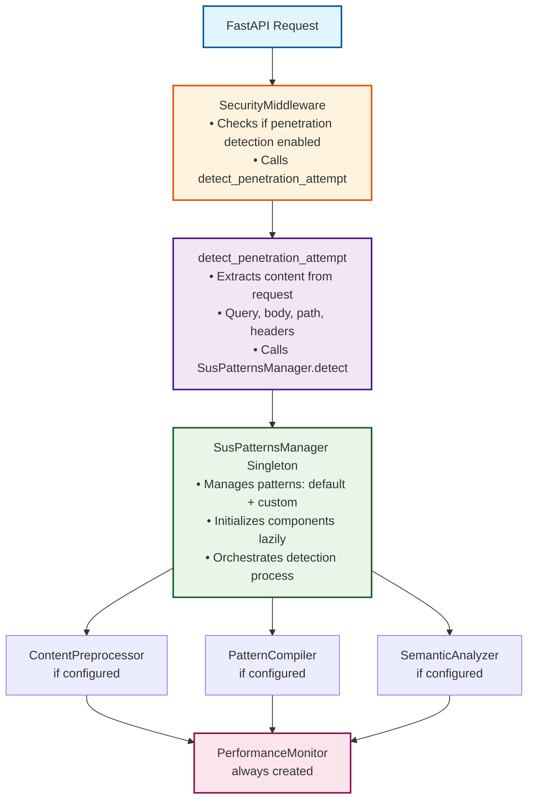
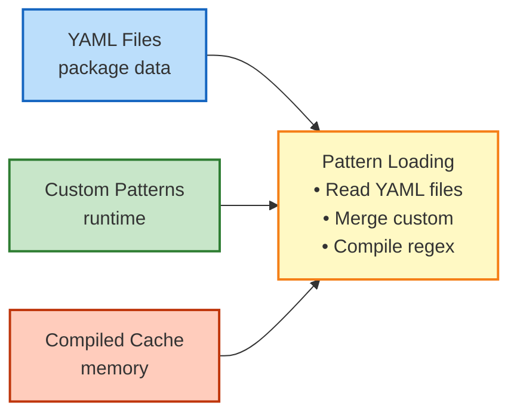

# Detection Engine Architecture

The FastAPI Guard Detection Engine uses a modular architecture that provides timeout-protected pattern matching with optional preprocessing and heuristic analysis. This document describes the actual implementation and how components interact.

## System Architecture



## Core Components

### 1. SusPatternsManager

The central component that manages the detection process:

```python
class SusPatternsManager:
    """Singleton pattern manager with enhanced detection capabilities."""
    
    _instance: SusPatternsManager | None = None
    _lock: threading.Lock = threading.Lock()
    
    def __new__(cls) -> SusPatternsManager:
        # Singleton implementation
        
    def __init__(self) -> None:
        # Load patterns from YAML files
        self.patterns: list[str] = []
        self.custom_patterns: set[str] = set()
        self.compiled_patterns: list[re.Pattern] = []
        
        # Detection engine components (initialized lazily)
        self._compiler: PatternCompiler | None = None
        self._preprocessor: ContentPreprocessor | None = None
        self._semantic_analyzer: SemanticAnalyzer | None = None
        self._performance_monitor: PerformanceMonitor | None = None
```

**Key Responsibilities:**

- Pattern loading from YAML files
- Custom pattern management
- Component initialization based on configuration
- Detection orchestration
- Result aggregation

### 2. Component Initialization

Components are initialized only when needed based on configuration:

```python
def _ensure_detection_components(self) -> None:
    """Initialize detection engine components based on configuration."""
    config = get_current_config()
    
    # PatternCompiler: Only if timeout > 0
    if config.detection_compiler_timeout > 0 and not self._compiler:
        self._compiler = PatternCompiler(config)
    
    # ContentPreprocessor: Only if max_content_length > 0
    if config.detection_max_content_length > 0 and not self._preprocessor:
        self._preprocessor = ContentPreprocessor(config)
    
    # SemanticAnalyzer: Only if threshold > 0
    if config.detection_semantic_threshold > 0 and not self._semantic_analyzer:
        self._semantic_analyzer = SemanticAnalyzer(config)
    
    # PerformanceMonitor: Always created
    if not self._performance_monitor:
        self._performance_monitor = PerformanceMonitor(config)
```

## Detection Flow

### 1. Request Reception

```python
# In middleware.py
if self.config.enable_penetration_detection:
    detection_result, trigger_info = await detect_penetration_attempt(request)
    if detection_result:
        # Handle detected attack
```

### 2. Content Extraction

```python
# In utils.py
async def detect_penetration_attempt(request: Request) -> tuple[bool, str]:
    # Extract content from various sources
    contents_to_check = []
    
    # Query parameters
    if request.query_params:
        for key, value in request.query_params.items():
            contents_to_check.append((f"{key}={value}", "query_param"))
    
    # Request body
    body = await get_body_content(request)
    if body:
        contents_to_check.append((body, "body"))
    
    # Path parameters
    if path_params := request.path_params:
        contents_to_check.append((str(path_params), "path"))
    
    # Headers
    for header, value in request.headers.items():
        contents_to_check.append((f"{header}: {value}", "header"))
```

### 3. Detection Process

```python
# For each content piece
for content, context in contents_to_check:
    result = await sus_patterns_handler.detect(
        content=content,
        ip_address=client_ip,
        context=context,
        correlation_id=correlation_id
    )
    
    if result["is_threat"]:
        return True, format_trigger_info(result)
```

### 4. Detection Implementation

The actual detection in `SusPatternsManager.detect()`:

```python
async def detect(self, content: str, **kwargs) -> dict[str, Any]:
    start_time = time.time()
    threats = []
    timeouts = []
    
    # 1. Ensure components are initialized
    self._ensure_detection_components()
    
    # 2. Preprocess content
    if self._preprocessor:
        processed_content = self._preprocessor.preprocess(content)
        preserved_attacks = processed_content != content[:len(processed_content)]
    else:
        processed_content = content
        preserved_attacks = False
    
    # 3. Pattern matching
    for i, pattern in enumerate(self.compiled_patterns):
        pattern_str = self.patterns[i] if i < len(self.patterns) else str(pattern.pattern)
        
        if self._compiler:
            # Use timeout-protected matching
            safe_matcher = self._compiler.create_safe_matcher(pattern_str, pattern)
            match_result = await safe_matcher(processed_content)
            
            if match_result:
                if match_result.get("timeout"):
                    timeouts.append(pattern_str)
                elif match_result.get("match"):
                    threats.append({
                        "type": "regex",
                        "pattern": pattern_str,
                        "execution_time": match_result.get("execution_time", 0)
                    })
        else:
            # Fallback to direct matching
            try:
                if pattern.search(processed_content):
                    threats.append({
                        "type": "regex",
                        "pattern": pattern_str
                    })
            except Exception:
                pass
    
    # 4. Semantic analysis
    if self._semantic_analyzer and not threats:
        semantic_result = self._semantic_analyzer.analyze_content(processed_content)
        if semantic_result["score"] > self._semantic_analyzer.threshold:
            threats.append({
                "type": "semantic",
                "score": semantic_result["score"],
                "attack_types": semantic_result["attack_types"],
                "confidence": semantic_result["confidence"]
            })
    
    # 5. Performance tracking
    execution_time = time.time() - start_time
    if self._performance_monitor:
        for threat in threats:
            await self._performance_monitor.record_metric(
                pattern=threat.get("pattern", "semantic"),
                execution_time=threat.get("execution_time", execution_time),
                matched=True,
                timeout=False
            )
    
    # 6. Build result
    return {
        "is_threat": len(threats) > 0,
        "threat_score": max((t.get("score", 1.0) for t in threats), default=0.0),
        "threats": threats,
        "context": kwargs.get("context", "unknown"),
        "original_length": len(content),
        "processed_length": len(processed_content),
        "execution_time": execution_time,
        "detection_method": "enhanced" if self._compiler else "legacy",
        "timeouts": timeouts,
        "correlation_id": kwargs.get("correlation_id")
    }
```

## Data Flow

### Pattern Loading



### Detection Result Structure

```python
{
    "is_threat": bool,              # True if any threat detected
    "threat_score": float,          # 0.0-1.0, highest score
    "threats": [                    # List of detected threats
        {
            "type": "regex",        # or "semantic"
            "pattern": str,         # For regex matches
            "score": float,         # For semantic matches
            "execution_time": float # Pattern execution time
        }
    ],
    "context": str,                 # Where content came from
    "original_length": int,         # Original content length
    "processed_length": int,        # After preprocessing
    "execution_time": float,        # Total detection time
    "detection_method": str,        # "enhanced" or "legacy"
    "timeouts": list[str],         # Patterns that timed out
    "correlation_id": str | None    # Request correlation ID
}
```

## Integration Points

### 1. Configuration Integration

The engine reads configuration from `SecurityConfig`:

```python
# Key configuration fields
config.enable_penetration_detection     # Enable/disable
config.detection_compiler_timeout       # Pattern timeout
config.detection_max_content_length     # Content limit
config.detection_preserve_attack_patterns # Preservation
config.detection_semantic_threshold     # Semantic threshold
config.detection_slow_pattern_threshold # Performance threshold
```

### 2. Redis Integration (Optional)

When Redis is enabled:
- Custom patterns can be stored/retrieved
- Performance metrics can be aggregated
- Pattern effectiveness can be tracked

### 3. Agent Integration (Optional)

When Agent is enabled:
- Detection events are sent with full context
- Performance metrics are reported
- Pattern effectiveness is tracked

## Security Considerations

### 1. ReDoS Prevention

The engine prevents Regular Expression Denial of Service through:

```python
# In PatternCompiler.create_safe_matcher()
async def safe_matcher(content: str) -> dict[str, Any] | None:
    try:
        start = time.time()
        match = await asyncio.wait_for(
            asyncio.to_thread(pattern.search, content),
            timeout=self.timeout
        )
        return {
            "match": match,
            "execution_time": time.time() - start
        }
    except asyncio.TimeoutError:
        return {"timeout": True}
```

### 2. Resource Management

- **Memory**: Content preprocessing limits input size
- **CPU**: Timeout protection prevents excessive CPU usage
- **Concurrency**: Thread pool executor prevents blocking
- **Caching**: Bounded caches prevent memory leaks

### 3. Error Isolation

Each component handles errors independently:
- Pattern compilation errors don't crash the system
- Timeout errors are logged but don't stop detection
- Component initialization failures fall back gracefully

## Performance Characteristics

### Latency Impact

| Component | Typical Latency | Max Latency |
|-----------|----------------|-------------|
| Preprocessing | < 1ms | 5ms |
| Pattern Matching (per pattern) | < 0.1ms | timeout value |
| Semantic Analysis | 1-5ms | 10ms |
| Total Detection | 5-20ms | 50ms |

### Memory Usage

- Pattern storage: ~100KB for default patterns
- Compiled pattern cache: ~1MB
- Performance history: ~500KB (configurable)
- Total overhead: ~2-5MB per instance

## Monitoring and Debugging

### Performance Monitoring

```python
# Get performance statistics
stats = await sus_patterns_handler.get_performance_stats()

# Example output
{
    "slow_patterns": [...],          # Patterns exceeding threshold
    "problematic_patterns": [...],   # Patterns with issues
    "summary": {
        "total_executions": 10000,
        "average_time": 0.002,
        "timeout_rate": 0.001,
        "match_rate": 0.05
    }
}
```

### Component Status

```python
# Check component status
status = await sus_patterns_handler.get_component_status()

# Example output
{
    "compiler": True,           # PatternCompiler active
    "preprocessor": True,       # ContentPreprocessor active
    "semantic_analyzer": False, # Not configured
    "performance_monitor": True # Always active
}
```

## Best Practices

1. **Configuration**: Start with defaults, adjust based on monitoring
2. **Pattern Management**: Regularly review and optimize patterns
3. **Performance**: Monitor slow patterns and remove/optimize them
4. **Security**: Always enable timeout protection in production
5. **Testing**: Test patterns in staging before production deployment

## Limitations

1. **Pattern-Based**: Relies on known attack patterns
2. **Context-Unaware**: Doesn't understand application-specific logic
3. **Performance Trade-offs**: More detection = higher latency
4. **False Positives**: Legitimate content may match patterns

## Future Considerations

While not currently implemented, potential enhancements could include:

- True machine learning models
- Distributed pattern learning
- Real-time threat intelligence feeds
- Context-aware detection
