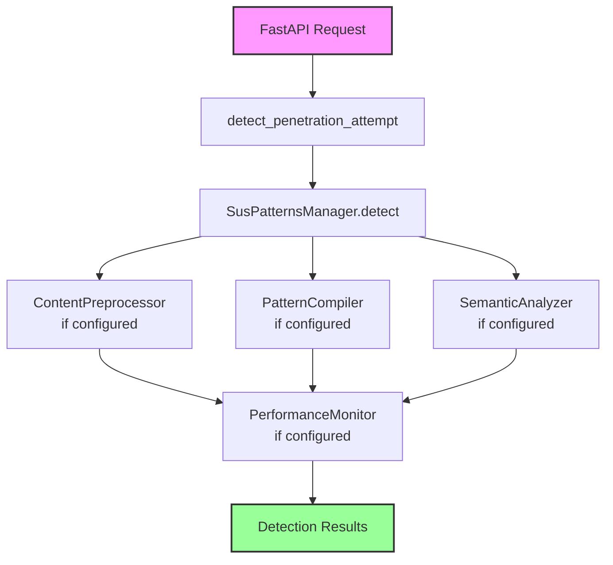

# Detection Engine

The FastAPI Guard Detection Engine is an enhanced pattern-based threat detection system that provides protection against common web application attacks through timeout-protected pattern matching and optional heuristic analysis.

## Overview

The Detection Engine is an evolution of FastAPI Guard's suspicious patterns system, introducing:

- **Timeout Protection**: Prevents ReDoS attacks through configurable execution timeouts
- **Content Preprocessing**: Truncates content while preserving potential attack patterns
- **Optional Semantic Analysis**: Heuristic-based detection for obfuscated attacks (disabled by default)
- **Performance Tracking**: Monitors pattern execution times to identify slow patterns
- **Singleton Architecture**: Centralized pattern management with lazy initialization

## Key Features

### 1. Pattern Matching with Timeout Protection

The engine protects against Regular Expression Denial of Service (ReDoS) by:
- Wrapping pattern execution in asyncio timeouts
- Configurable timeout via `detection_compiler_timeout` (default: 2.0 seconds)
- Graceful handling of timeout events
- Logging of patterns that exceed timeout thresholds

### 2. Content Preprocessing

The `ContentPreprocessor` component:
- Truncates content to `detection_max_content_length` (default: 10,000 characters)
- Preserves attack patterns when `detection_preserve_attack_patterns` is True
- Uses a sliding window approach to retain potential threats
- Returns both processed content and preservation metrics

### 3. Optional Semantic Analysis

When enabled, provides heuristic-based detection:
- Pattern-based heuristics for SQL injection, XSS, path traversal, etc.
- Configurable threshold via `detection_semantic_threshold` (default: 0.7)
- Returns probability scores and detected attack types
- Must be explicitly enabled in configuration

### 4. Performance Monitoring

Tracks execution metrics:
- Records pattern execution times
- Identifies slow patterns exceeding `detection_slow_pattern_threshold`
- Maintains rolling statistics with configurable history size
- Provides performance summaries and anomaly detection

## Architecture

The Detection Engine uses a modular design:



## Basic Usage

The Detection Engine is automatically used when penetration detection is enabled:

```python
from fastapi import FastAPI
from guard import SecurityMiddleware, SecurityConfig

app = FastAPI()

# Configure with detection engine settings
config = SecurityConfig(
    # Enable penetration detection
    enable_penetration_detection=True,
    
    # Pattern execution timeout (prevents ReDoS)
    detection_compiler_timeout=2.0,
    
    # Content preprocessing
    detection_max_content_length=10000,
    detection_preserve_attack_patterns=True,
    
    # Optional: Enable semantic analysis
    # Note: Requires explicit configuration
    detection_semantic_threshold=0.7,
    
    # Performance monitoring
    detection_slow_pattern_threshold=0.1,
    detection_monitor_history_size=1000,
)

app.add_middleware(SecurityMiddleware, config=config)
```

## How It Works

### 1. Request Analysis

When a request arrives, `detect_penetration_attempt()` extracts content from:
- Query parameters
- Request body (JSON, form data)
- Path parameters
- Headers

### 2. Detection Process

For each content piece, the engine:

```python
# 1. Preprocessing (if max_content_length is configured)
if len(content) > config.detection_max_content_length:
    content = preprocessor.preprocess(content)

# 2. Pattern matching with timeout protection
for pattern in patterns:
    with timeout(config.detection_compiler_timeout):
        if pattern.search(content):
            # Attack detected

# 3. Semantic analysis (if threshold is configured)
if config.detection_semantic_threshold > 0:
    result = semantic_analyzer.analyze_content(content)
    if result['score'] > config.detection_semantic_threshold:
        # Attack detected

# 4. Performance tracking (always enabled)
performance_monitor.record_metric(...)
```

### 3. Results

The engine returns detailed information about detected threats:

```python
{
    "is_threat": True,
    "threat_score": 0.85,
    "threats": [
        {
            "type": "regex",
            "pattern": "union.*select",
            "execution_time": 0.002
        }
    ],
    "context": "body:json",
    "original_length": 500,
    "processed_length": 500,
    "execution_time": 0.015,
    "detection_method": "enhanced",
    "timeouts": [],  # List of patterns that timed out
    "correlation_id": "request-123"
}
```

## Configuration Reference

### Detection Settings

| Setting | Type | Default | Description |
|---------|------|---------|-------------|
| `enable_penetration_detection` | bool | `True` | Enable/disable detection engine |
| `detection_compiler_timeout` | float | `2.0` | Maximum seconds for pattern execution |
| `detection_max_content_length` | int | `10000` | Maximum characters to analyze |
| `detection_preserve_attack_patterns` | bool | `True` | Preserve potential attacks during truncation |
| `detection_semantic_threshold` | float | `0.7` | Threshold for semantic detection (0=disabled) |
| `detection_anomaly_threshold` | float | `3.0` | Standard deviations for performance anomaly |
| `detection_slow_pattern_threshold` | float | `0.1` | Seconds to consider pattern slow |
| `detection_monitor_history_size` | int | `1000` | Number of metrics to keep |
| `detection_max_tracked_patterns` | int | `1000` | Maximum patterns to track |

## Component Initialization

Components are initialized only when needed:

- **PatternCompiler**: Created if `detection_compiler_timeout` > 0
- **ContentPreprocessor**: Created if `detection_max_content_length` > 0
- **SemanticAnalyzer**: Created if `detection_semantic_threshold` > 0
- **PerformanceMonitor**: Always created for tracking

## Pattern Management

### Default Patterns

The engine loads patterns from:
1. Built-in YAML files in the package
2. Custom patterns added via API

### Adding Custom Patterns

```python
from guard.handlers.suspatterns_handler import sus_patterns_handler

# Add a pattern
await sus_patterns_handler.add_pattern(
    r"(?i)malicious.*pattern",
    custom=True
)

# Remove a pattern
await sus_patterns_handler.remove_pattern(
    r"(?i)malicious.*pattern",
    custom=True
)

# Clear all custom patterns
await sus_patterns_handler.clear_custom_patterns()
```

## Performance Considerations

### Timeout Protection

The timeout mechanism uses `asyncio.wait_for()` to prevent patterns from running indefinitely:

```python
try:
    result = await asyncio.wait_for(
        pattern_match(content),
        timeout=config.detection_compiler_timeout
    )
except asyncio.TimeoutError:
    # Pattern timed out, log and continue
    timeouts.append(pattern_string)
```

### Memory Usage

- Content preprocessing limits memory usage by truncating large inputs
- Performance history is bounded by `detection_monitor_history_size`
- Pattern tracking is limited to `detection_max_tracked_patterns`

### CPU Usage

- Timeout protection prevents CPU-intensive patterns from blocking
- Slow patterns are identified and can be optimized or removed
- Semantic analysis adds overhead only when explicitly enabled

## Integration Points

### Redis Integration

When Redis is enabled:
- Custom patterns can be shared across instances
- Performance metrics can be aggregated
- Pattern effectiveness can be tracked globally

### Agent Integration

When Agent is enabled:
- Detection events are sent with full context
- Performance metrics are reported
- Pattern effectiveness is tracked

## Limitations

1. **Pattern-Based**: The engine relies on regex patterns and heuristics, not true AI/ML
2. **Language Agnostic**: Patterns may not understand context-specific semantics
3. **Performance Trade-offs**: More thorough detection requires more processing time
4. **False Positives**: Legitimate content may trigger patterns

## Best Practices

1. **Start with Defaults**: The default configuration works well for most applications
2. **Monitor Performance**: Use `get_performance_stats()` to identify slow patterns
3. **Adjust Timeouts**: Set timeouts based on your latency requirements
4. **Test Patterns**: Validate custom patterns don't cause false positives
5. **Enable Gradually**: Start with basic detection and enable advanced features as needed

## Troubleshooting

### High False Positive Rate

- Increase `detection_semantic_threshold`
- Review and refine custom patterns
- Consider disabling problematic default patterns

### Performance Issues

- Reduce `detection_max_content_length`
- Increase `detection_compiler_timeout`
- Remove slow patterns identified by monitoring

### Memory Usage

- Decrease `detection_monitor_history_size`
- Reduce `detection_max_tracked_patterns`

## Next Steps

- Review [Detection Engine Components](components.md) for detailed component documentation
- See [Configuration Guide](configuration.md) for advanced configuration
- Check [Performance Tuning](performance-tuning.md) for optimization tips
